# 🎨 ComfyUI-MCP-Agent

### **The ultimate bridge between Claude Desktop and Cloud-based Image Generation.**

   

A robust **Model Context Protocol (MCP)** server that connects your local coding environment to a remote **ComfyUI** instance (running on Google Colab). It allows Claude to "see" your request and generate professional AI assets instantly, with zero load on your local machine.

---

## 🏗️ Architecture

```mermaid
graph LR
    User(👱 You) -- "Make a website" --> Claude(🤖 Claude Desktop)
    subgraph Local Computer
        Claude -- "Request Image" --> MCP(🔌 MCP Server)
        MCP -- "Forward Request" --> Ngrok(🚇 Ngrok Tunnel)
    end
    subgraph Cloud Layer
        Ngrok --> Colab(☁️ Google Colab)
        Colab -- "Execute Workflow" --> ComfyUI[🎨 ComfyUI Engine]
        ComfyUI -- "Return Image" --> Ngrok
    end
    Ngrok --> MCP
    MCP --> Claude -- "Embed Image" --> User
```



---

## ✨ Key Features

### ☁️ **Zero-GPU Architecture**
* Offloads 100% of the heavy lifting to **Google Colab's Free T4 GPUs**.
* Your local machine stays cool and quiet—no heavy VRAM usage required.
* Works on any laptop (Mac, Windows, Linux) capable of running Claude.

### 🔌 **Native MCP Integration**
* Implements the official **Model Context Protocol**.
* Claude "knows" it has a camera/paintbrush tool (`generate_image`).
* Seamlessly handles prompting, image generation, and file saving in one step.

### 🛡️ **Resilient Tunneling**
* Uses **Ngrok** for secure, encrypted tunnels between the Cloud and your PC.
* Automatically handles connection drops and URL forwarding.
* Zero complex router configuration or port forwarding needed.

### 🎨 **Customizable Workflows**
* Supports standard ComfyUI `workflow_api.json` format.
* Easily swap models (Stable Diffusion XL, Flux, Realistic Vision).
* Configurable steps, seeds, and sampling methods directly from Python.

---

## 🛠️ Tech Stack

| Component | Technology | Why? |
| :--- | :--- | :--- |
| **Orchestration** | **MCP (Anthropic)** | Native tool integration allows Claude to "think" and "act" autonomously. |
| **Compute** | **Google Colab** | Access to 16GB+ VRAM GPUs for free; ideal for running Flux/SDXL. |
| **Engine** | **ComfyUI** | Node-based generation offers superior control over pipelines compared to A1111. |
| **Tunneling** | **Ngrok** | Exposes the Colab local server to the internet securely with one line of code. |
| **Language** | **Python 3.12** | Universal compatibility and rich library ecosystem for API handling. |
| **Config** | **Dotenv** | Type-safe configuration with automatic `.env` loading for security. |

---

## 📦 Installation

### **Prerequisites**
* **Python 3.10** or higher
* **Claude Desktop App** installed
* **Ngrok Account** (Free tier is fine)
* **Google Account** (for Colab)

### **Setup Guide**

#### **1. Clone the repository**
```bash
git clone [https://github.com/Nikhilchapkanade/comfyui-mcp-agent.git](https://github.com/Nikhilchapkanade/comfyui-mcp-agent.git)
cd comfyui-mcp-agent
```

#### **2. Configure Environment**
Create a `.env` file in the `agent_project` directory:
```bash
cp agent_project/.env.example agent_project/.env
```
Edit `.env` and add your Ngrok URL (generated in the next step):
```env
# Required
COMFY_URL=[https://your-ngrok-url.ngrok-free.app](https://your-ngrok-url.ngrok-free.app)
```

#### **3. Install Dependencies**
```bash
pip install -r requirements.txt
```

#### **4. Start the Cloud Backend**
1.  Open the provided **Colab Notebook** (link in repo).
2.  Paste your **Ngrok Auth Token** when prompted.
3.  Run all cells.
4.  **Copy the public URL** (e.g., `https://xyz.ngrok-free.app`) and update your `.env` file.

#### **5. Connect to Claude**
Update your Claude config file (`%APPDATA%\Claude\claude_desktop_config.json`):
```json
{
  "mcpServers": {
    "comfy-cloud": {
      "command": "python",
      "args": [
        "-u", 
        "C:\\Path\\To\\Your\\agent_project\\server.py"
      ]
    }
  }
}
```

---

## 📂 Project Structure

```text
comfyui-mcp-agent/
├── agent_project/
│   ├── src/
│   │   ├── __init__.py
│   │   ├── client.py        # Handles ComfyUI API communication
│   │   ├── server.py        # Main MCP Server entry point
│   │   └── utils.py         # Image processing & base64 conversion
│   ├── workflows/
│   │   └── text_to_image.json # Raw ComfyUI workflow format
│   ├── output/              # Local storage for generated images
│   ├── .env                 # Environment variables (GitIgnored)
│   └── requirements.txt     # Python dependencies
├── .gitignore
└── README.md
```

---

## ⚙️ Configuration

| Variable | Required | Default | Description |
| :--- | :--- | :--- | :--- |
| `COMFY_URL` | ✅ Yes | `None` | The public Ngrok URL from your Colab session. |
| `OUTPUT_DIR` | ❌ No | `./output` | Where generated images are saved locally. |
| `WORKFLOW_FILE` | ❌ No | `text_to_image.json` | The JSON workflow to use for generation. |

---

## 🚀 Usage

### **1. Launch the Server**
Ensure your Colab notebook is running and your `.env` is updated.

### **2. Prompt Claude**
Open Claude Desktop and try these commands:

> "Create a landing page for a coffee shop. Generate a hero image of a steaming latte on a wooden table."

> "I'm building a game. Generate a pixel-art sprite sheet of a knight running."

### **3. Troubleshooting**

**🔴 Icon Not Showing in Claude**
* **Cause:** Config file path error or Python script crashing silently.
* **Fix:** Check `AppData\Roaming\Claude\logs` and ensure you used double slashes `\\` in your JSON config.

**🟠 "Connection Refused" Error**
* **Cause:** The Ngrok tunnel has expired or changed.
* **Fix:** Restart the Colab cell, get the new URL, and update your `.env` file.

**🟡 "Workflow Not Found"**
* **Cause:** The `text_to_image.json` file is missing from the `workflows` folder.
* **Fix:** Ensure the file structure matches the "Project Structure" section above.

---

## 🤝 Contributing

We welcome contributions! Please follow these steps:
1.  Fork the repository.
2.  Create a feature branch (`git checkout -b feature/AmazingFeature`).
3.  Commit your changes (`git commit -m 'Add AmazingFeature'`).
4.  Push to the branch (`git push origin feature/AmazingFeature`).
5.  Open a Pull Request.

---

